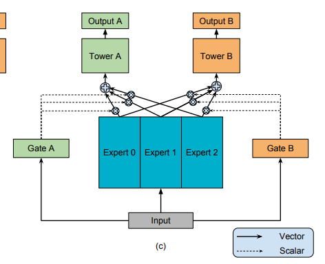
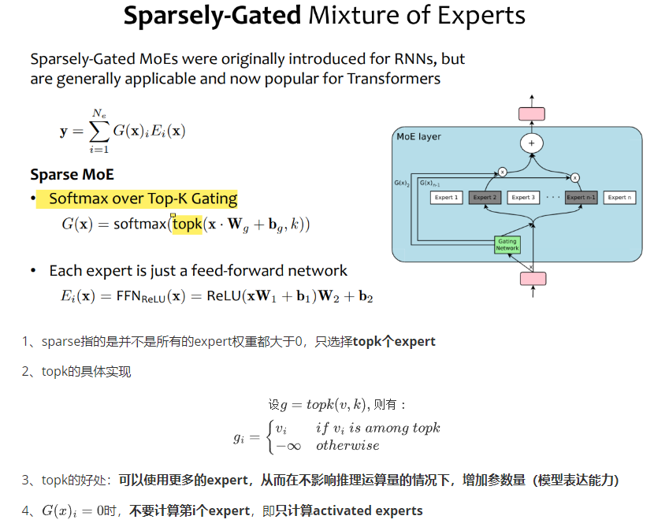
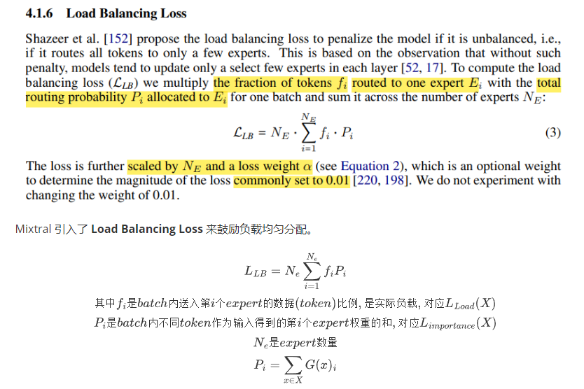
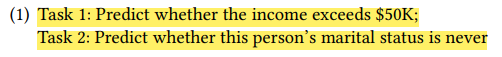
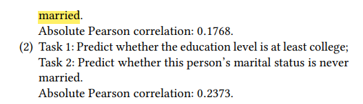

# 什么是MMOE？

1、有多个expert（每个expert就是一个MLP，当然也可以更复杂）

2、有多个任务（每个任务有自己的task tower，也是一个MLP）

3、每个任务对应一个gate，这个gate输出的是一个softmax后的向量，通过这个softmax向量来加权平均每个expert的输出，然后将这个加权和作为其task tower的输入

# OLMOE的改进？

简单来说就是从选择所有expert做加权和，转换为选择权重最大的k个expert做加权和。

优点：假设我们线上推理只允许有8个expert的算力。用MMOE只能训练8个expert；而OLMOE可以通过设置k=8,$N_e=64$，从而训练64个expert。

# 如何使多expert负载均衡？

## 极化现象

假设有4个experts，其中expert A学的特别好，expert B,C,D都欠拟合。这很可能导致我们每次gate算出权重后都是[1,0,0,0]，MMOE退化为单expert。

## 解决方法1：加dropout

MMOE的解决方法：在gate的softmax前增加一个dropout层。

例：如果出现上述极化现象，如logits=[100,1,1,1]，softmax后会趋近于[1,0,0,0]。

倘若在softmax前做dropout，使得logits变成[0,1,1,1]，softmax后expert A的权重就会很小，这将迫使模型不得依赖expert A。如果模型依旧依赖expert A，一旦expert A的权重被drop掉，模型性能就会很差，所以随着训练，模型会逐渐降低对expert A的依赖。

## 解决方法2：增加负载均衡损失

# 具体实验

## 数据集

采用Census Income Dataset，这是一个非常小的数据集

或者采用[人工合成的数据](https://blog.csdn.net/cyj972628089/article/details/127634934)

## 多任务

第一组多任务是相关性较弱一些

## 模型

[baseline](https://blog.csdn.net/cyj972628089/article/details/127633915)采用MMOE

我们的改进尝试实现top-k MMOE