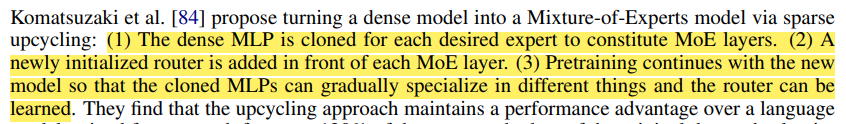
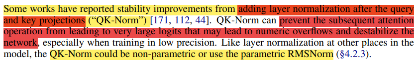

# MOE

## MOE vs dense

1、dense模型采用1.3B；MOE采用1.3B激活参数和6.9B总参数量。保证二者的激活参数量相同

2、MOE的$N_e=64,k=8$

3、发现MOE只需要消耗$\frac{1}{3}$的数据量就能达到和dense消耗所有数据量的效果。因为二者激活参数量相同，所以可以说MOE实现了**1/3计算量**

4、达到dense最终性能时，MOE只花了一般的时间，所以实现了**2倍训练速度**(这是因为MOE总参数量更大，因为更大内存消耗导致每秒能处理的token数比dense少)

## expert数量

experts数量增大到64以后，提升的性能非常有限，最终选择$N_e=64,k=8$

## shared experts

增加一个shared expert，可能性能还不如没有shared expert

## Expert Choice vs Token Choice

1、**Expert Choice(EC)：每个expert选择sequence中固定数量的token**

优点：因为每个expert都选择相同数量的token，所以**不需要负载均衡**；可能有的tokens会被多个expert选中，这可能提升模型技能能，因为EC让模型能分配更多的计算量给部分token

缺点：LLM是自回归生成式任务，输入并不是整个sequence，很难实现EC；**EC可能导致token dropping，即部分token没有被任何expert选择**

2、**Token Choice(TC)：每个token选择固定数量的expert**

优点：容易实现

缺点：**可能导致许多token选择相同的expert，所以需要负载均衡**

3、结论：**含负载均衡loss的TC优于EC**

## Sparse Upcycling

1、sparse upcyling：用一个已经预训练好的dense模型复制多份作为expert，然后添加初始化的router层（gate），最后微调

2、作者用在2T tokens上预训练好的OLMO-1B作为dense模型，复制8份作为expert，取k=2。

3、大约在微调600B tokens时，sparse upcycling和MOE from scratch效果相同。此时sparse cyling相当于一共用了2T+600B=2.6T tokens，MOE from scratch 用了600B=0.6T tokens。这说明**MOE from scratch 只需要25%的计算量就可以赶上sparse upcyling的效果**。且在600B tokens之后，MOE from scratch大有超越sparse upcyling的趋势。

4、除此之外，**sparse upcyling受限于预训练dense model**。因为**预训练dense model可能已经训练的很好了，其参数很可能已经在一个很优的范围，这会限制微调所能带来的探索区域，导致各expert难以个性化。**（证明见domain specification）

5、综上，作者没有使用sparse upcyling，而是用MOE from scratch

### domain specialization

上半部分来自于OLMOE-1B-7B，下半部分来自于Mixtral-8x7B

- **OLMOE-1B-7B是MOE from scratch，Mixtral-8x7B则是sparse upcycling**
- **OLMOE-1B-7B明显各expert都专精不同，有的专精github，有的专精arxiv。**
- **Mixtral-8x7B各expert则基本没有特点，都是差不多的通用专家。这可能是因为Mixtral-8x7B采用sparse upcyling，因为各专家均初始化自相同的dense模型，所以其特化（specialization）被限制**

## Load Balancing Loss

### Sparse MOE

在Sparse MOE中，作者通过$L_{importance}(X)$和$L_{Load}(X)$来平衡不同expert的使用。

$$
设X为小批次数据,x为X内的一个数据\\
定义第i个expert在小批次数据X上的重要度为:\\
Importance(X)_i=\sum_{x\in X}G(x)\\
由此可见Importance(X)是一个向量
$$
**想要让各expert的重要度相近，作者的思路是降低不同expert重要度的方差。**

引入**Coefficient of Variation**（变异系数，CV）：
$$
CV(v)=\frac{\sigma}{\mu}\\
其中\sigma是向v量内各元素的标准差\\
\mu是向量v内各元素的均值
$$
我们记**重要度损失**为：
$$
L_{importance}(X)=w_{importance}\cdot [CV(Importance(X))]^2
$$
然而重要度损失并不够，因为**很容易出现某个expert在批次数据X上的重要度虽然很大，但其重要度很大是因为在少量样本上重要度很大，而非在很多样本上重要度较大。这会导致该expert实际接受的是少量大权重样本。**因为我们实际的**负载均衡是针对样本而言**，所以光用$L_{importance}(X)$并不够。

为此作者引入$L_{Load}(X)$。

首先定义$P(x,i)$，表示**输入为x（在LLM中是batch数据内的一个token，即单个数据）时第i个expert被激活(是topk)的概率(省略了bias)。**其中StandardNormal()是一个外部引入的标准正态分布，通过外置随机性可以被视为常量。
$$
softplus(x)=log(1+exp(x))\\
kth\_excluding(H(x),k,i)指的是H(x)中不包含H(x)_i的第k大元素
$$
换言之，大于不包含自己的第k大元素，就说明自身肯定是topk。
$$
P((xW_g)_i+StandardNormal()\cdot Softplus((x\cdot W_{noise})_i)\\
>kth\_excluding(H(x),k,i))\\
等价于\\
P(StandardNormal()>\frac{kth\_excluding(H(x),k,i)-(xW_g)_i}{Softplus((x\cdot W_{noise})_i)})\\
因为标准正态分布是对称的,所以这等价于\\
P(StandardNormal()\le\frac{(xW_g)_i-kth\_excluding(H(x),k,i)}{Softplus((x\cdot W_{noise})_i)})\\
这一项满足标准正态分布CDF的定义,所以等价于\\
P(x,i)=\phi(\frac{(xW_g)_i-kth\_excluding(H(x),k,i)}{Softplus((x\cdot W_{noise})_i)})\\
其中\phi是标准正态分布的CDF
$$
进一步的，因为我们的输入数据往往是以minibatch的形式，所以我们定义**在minibatch数据X内第i个expert的负载**为：
$$
Load(X)_i=\sum_{x\in X} P(x,i)
$$
**想要均衡负载，其实就是想要降低$Load(X)$这个向量不同元素间的方差。**

同样引入**Coefficient of Variation**（变异系数，CV）：
$$
CV(Load(X))=\frac{\sigma}{\mu}\\
其中\sigma是Load(X)向量内各元素的标准差\\
\mu是Load(X)向量内各元素的均值
$$
最终，我们**记负载均衡损失**为：
$$
L_{Load}(X)=w_{load}\cdot [CV(Load(X))]^2
$$
综上所述，为了均衡各expert的使用，作者引入了两个loss：
$$
L_{importance}(X)+L_{Load}(X)\\
=w_{importance}\cdot [CV(Importance(X))]^2+w_{load}\cdot [CV(Load(X))]^2
$$

作者调整$w_{importance}和w_{load}$的实验结果如上。

### OLMOE

Mixtral 引入了 **Load Balancing Loss** 来鼓励负载均匀分配。
$$
L_{LB}=N_e\sum_{i=1}^{N_e }f_iP_i\\
其中f_i是batch内送入第i个expert的数据(token)比例,是实际负载,对应L_{Load}(X)\\
P_i是batch内不同token作为输入得到的第i个expert权重的和,对应L_{importance}(X)\\
N_e是expert数量\\
P_i=\sum_{x\in X} G(x)_i\\
所以L_{LB}其实就是Sparse\;MOE中两个损失函数的精简版本
$$

### 效果

1、**无论是training loss还是validation loss，引入LBL后性能提升**

2、不用LBL时，只有expert1和expert6被经常激活，其他expert基本不被使用，这导致其余expert浪费GPU内存

3、不用LBL时，我们也可以计算LBL loss，发现LBL loss先激增后逐渐降低至收敛。这与Figure10中No LBL时，一开始只用expert6，后续一半用expert6 一半用expert1相吻合

## Router Z-loss

1、为了提升MOE的稳定性和质量，作者引入了Router Z-loss。该辅助损失函数**惩罚gating network的输入中的large logits**
$$
L_{RZ}(x)=\frac{1}{B}\sum_{i=1}^B(log\sum_{j=1}^{D}exp(x_j^{(i)}))^2\\
其中x如下图,是attention层layer-norm后的输出\\
x_j^{(i)}指的是batch内第i个数据的第j维\\
B是batch\_size,D指的是x^{(i)}的维度\\
注:论文里的\sum_{j=1}^{N_E}是错的,应该是\sum_{i=1}^{D}
$$

2、training loss，validation loss、下游任务性能均有提升，且更加稳定

## 最终损失函数

最终的损失函数是LLM 交叉熵和两个辅助函数的加和，即
$$
L=L_{CE}+\alpha L_{LB}+\beta L_{RZ}\\
其中\alpha常取0.01,\beta常取0.001
$$

# General

## initialization

作者发现在训练450B token后，**用truncated normal initialization效果更好（标准差为0.02，上下界为0.06/-0.06)**

## RMSNorm

$$
\bold{y}=\frac{\bold x}{\sqrt{\sum_{i=1}^Dx_i^2}} \odot \bold{g}\\
注意\bold{g}是一个可学习的向量
$$

1、可以看出，**RMSNorm相当于均值为0的LN**，优化就体现在不用减均值，这使得计算速度大幅加快

2、作者发现这个$\bold{g}$非常重要，如果去掉$\bold{g}$（即non-parametic）则梯度范数和会很大，导致训练不稳定。

## QK-Norm

1、QK-Norm指的是在query and key projection后做RMS-Norm，从而防止attention操作中出现很大的logits从而导致溢出，进而导致训练不稳定

2、作者发现用QK-Norm确实能提升效果

# 微调和DPO

1、作者发现**在微调和DPO中，去掉load balancing loss可以提升性能，而且并不会导致负载不均衡。**

2、作者仍然保留Router Z-loss，因为能带来性能提升

3、作者对齐preference采用的是DPO

